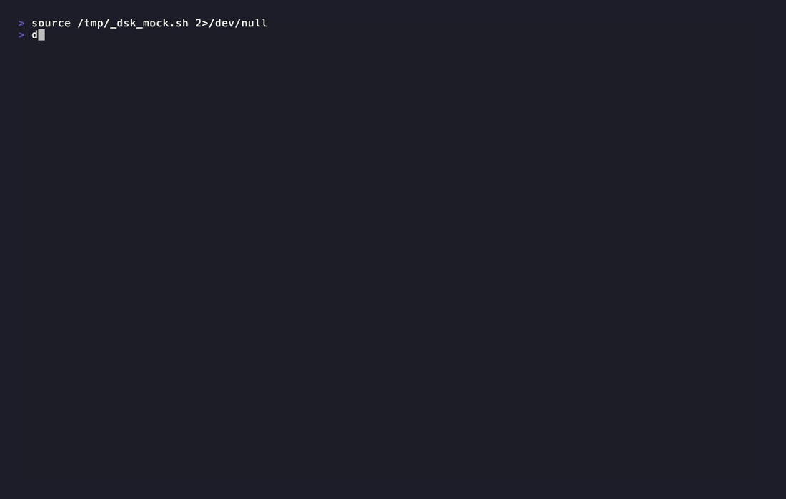

# DevSecOps Kit

Modern, opinionated CLI to bootstrap a complete security pipeline for small teams — instantly.

DevSecOps Kit detects your project type, generates a hardened CI/CD security workflow, and runs local scans with actionable results. Designed for small teams and developers who need practical DevSecOps without complexity.



## Features

### Project Detection

Automatically detects language and framework from your project files:

| Language | Detection files | Frameworks |
|----------|----------------|------------|
| Node.js | `package.json` | Express, Next.js, NestJS, Fastify, Koa |
| Go | `go.mod` | Gin, Echo, Fiber, Chi |
| Python | `requirements.txt`, `pyproject.toml`, `Pipfile`, `setup.py` | Django, Flask, FastAPI, Scrapy |
| Java | `pom.xml`, `build.gradle`, `build.gradle.kts` | Spring Boot, Quarkus, Micronaut |

Docker detection is included for all languages — Trivy image scanning is enabled automatically when a `Dockerfile` is present.

### Security Scanners

| Tool | What it scans | When it runs |
|------|--------------|--------------|
| **Semgrep** | SAST — code patterns, security anti-patterns | Always (opt-out) |
| **Gitleaks** | Secrets — API keys, tokens, passwords in code | Always (opt-out) |
| **Trivy** | Dependencies, container images, misconfigurations | Always (opt-out) |
| **Checkov** | IaC — Terraform, CloudFormation, K8s manifests, Dockerfiles | Opt-in |

### Multi-CI Workflow Generation

Generate security pipelines for any CI platform:

```bash
devsecops init                    # GitHub Actions (default)
devsecops init --ci=gitlab        # GitLab CI (.gitlab-ci.yml)
devsecops init --ci=bitbucket     # Bitbucket Pipelines (bitbucket-pipelines.yml)
```

All generated workflows include parallel scanner execution, configurable fail gates, artifact uploads, and automatic PR security summary comments (GitHub Actions only).

### Local Security Scanning

```bash
devsecops scan                        # Run all enabled scanners
devsecops scan --tool=semgrep         # Run a specific scanner
devsecops scan --tool=checkov         # Run IaC scanning
devsecops scan --format=terminal      # Rich terminal output (default)
devsecops scan --format=json          # JSON for CI integration
devsecops scan --format=html          # HTML report
devsecops scan --format=html --open   # HTML report, auto-open in browser
devsecops scan --format=sarif         # SARIF for GitHub Code Scanning
devsecops scan --fail-on-threshold    # Exit code 1 if thresholds exceeded
```

### SBOM Generation

Generate a Software Bill of Materials for compliance and supply chain visibility:

```bash
devsecops sbom                        # CycloneDX format (default)
devsecops sbom --format=spdx          # SPDX format
```

### AI Fix Suggestions

Get actionable fix suggestions for HIGH and CRITICAL findings, powered by your choice of LLM:

```yaml
# security-config.yml
ai:
  enabled: true
  provider: "ollama"                 # ollama | openai | anthropic
  model: "llama3.1"                  # model name for the selected provider
  endpoint: "http://localhost:11434" # local provider or approved AI gateway
  require_approved_provider: false
  allowed_providers: ["ollama"]
```

When enabled, each HIGH/CRITICAL finding in the terminal report includes a `💡 Fix:` suggestion. Suggestions are cached per unique rule+finding so identical issues are only sent to the LLM once per session.

For OpenAI or Anthropic, set the API key via environment variable instead of the config file:

```bash
export OPENAI_API_KEY=sk-...
export ANTHROPIC_API_KEY=sk-ant-...
```

### Security Auto Remediation

Run a local remediation flow for HIGH and CRITICAL dependency findings:

```bash
devsecops remediate --provider snyk
```

The current release supports Snyk Open Source dependency findings for Maven and Gradle manifests. It creates a local remediation branch, applies safe dependency updates when possible, runs project validation, and re-runs Snyk to confirm which findings were fixed.

The command does not commit, push, or open pull requests automatically. Changes are left in the remediation branch for review.

Requirements:

- `snyk` CLI installed and authenticated
- clean Git working tree
- project tests passing before remediation starts
- AI enabled in `security-config.yml`; deterministic dependency updates are attempted first, and AI patch generation is available when a direct fallback is not possible

Example result from a representative vulnerable Spring Boot Maven project:

```text
Auto Remediation Summary

Scanned:
22 findings

Fixed:
21

Failed:
1

Modified files:
pom.xml

Remaining findings:
1

Branch:
security/remediation-20260817-161954

Ready for review.
```

This example used Snyk Open Source findings against a Maven project. DevSecOps Kit grouped related findings by dependency, applied safe dependency updates, ran `mvn test`, and re-ran Snyk after each accepted change.

Example result from a representative vulnerable Spring Boot Gradle project:

```text
Auto Remediation Summary

Scanned:
7 findings

Fixed:
7

Failed:
0

Modified files:
build.gradle

Remaining findings:
0

Branch:
security/remediation-20260820-210544

Ready for review.
```

In the Gradle test project, DevSecOps Kit updated vulnerable direct dependencies in `build.gradle`, ran project validation, and confirmed with a Snyk re-scan that no HIGH or CRITICAL findings remained.

### Enterprise Readiness Notes

Security Auto Remediation is designed to keep developers in control while reducing repetitive remediation work. The current release intentionally leaves review, commit, push, and pull request creation as manual steps.

For regulated environments, consider these controls before enabling AI-assisted remediation broadly:

- Use an approved AI provider or internal AI gateway.
- Treat prompts and responses as audit-relevant remediation artifacts.
- Avoid sending source code to external providers unless approved by policy.
- Prefer local providers such as Ollama when code must remain on the workstation.
- Keep remediation branches reviewable and traceable.
- Align fail thresholds and remediation SLAs with your organization security standards.

Current threshold behavior is configuration-driven through `security-config.yml`. Teams can tune `fail_on` values today. The internal policy evaluator also includes SLA-aware PASS/WARN/FAIL support for future scanner or advisory integrations that provide reliable `first_seen` metadata; SLA policy is intentionally not enforced automatically unless that metadata is available.

### Remediation Audit Reports

Each Snyk remediation run writes a local JSON audit report under the user cache directory:

```text
<user-cache>/devsecops-kit/remediation-runs/<project>/<run-id>.json
```

On Windows this is typically under `AppData\\Local`. Keeping reports outside the project avoids making the working tree dirty.

The report includes:

- run ID, timestamps, provider, scanner, branch, and project metadata
- initial scan count and final remediation summary
- remediation events per dependency group
- modified files, validation status, re-scan status, and rollback reasons
- AI provider/model metadata when AI is used
- SHA-256 hashes and byte counts for prompts/responses instead of raw prompt or response content

This gives teams an audit trail without storing source-containing prompts by default. Teams can also route AI calls through an approved endpoint or gateway by setting `ai.endpoint`, and can require provider allowlisting with `ai.require_approved_provider`.

### Git Hooks

Block commits or warn on push when security issues exceed thresholds:

```bash
devsecops init-hooks              # Install pre-commit and pre-push hooks
devsecops init-hooks --uninstall  # Remove hooks
```

### Configuration

`security-config.yml` is generated by `devsecops init` and controls all scanner behavior:

```yaml
version: "0.8.0"

language: "python"
framework: "django"

severity_threshold: "high"

tools:
  semgrep: true
  trivy: true
  gitleaks: true
  checkov: false      # opt-in, requires: pip install checkov

exclude_paths:
  - "vendor/"
  - "node_modules/"
  - ".venv/"
  - "target/"

fail_on:
  gitleaks: 0           # fail if ANY secrets detected
  semgrep: 10           # fail if 10+ findings
  trivy_critical: 0     # fail if ANY critical CVEs
  trivy_high: 5         # fail if 5+ high CVEs
  trivy_medium: -1      # disabled (-1 = ignore)
  trivy_low: -1
  checkov: -1           # disabled by default

# policy:
#   profile: "default"
#   sla:
#     enabled: false
#     warn:
#       critical: 3
#       high: 14
#       medium: 60
#       low: 90
#     fail:
#       critical: 7
#       high: 30
#       medium: 90
#       low: 180

licenses:
  enabled: false
  deny: ["GPL-3.0", "AGPL-3.0"]
  allow: ["MIT", "Apache-2.0", "BSD-*"]

notifications:
  pr_comment: true
  slack: false
  email: false

# ai:
#   enabled: false
#   provider: "ollama"
#   model: "llama3.1"
#   endpoint: "http://localhost:11434"  # optional provider endpoint / approved gateway
#   require_approved_provider: false
#   allowed_providers: ["ollama"]
```

### Other Commands

```bash
devsecops detect      # Show detected language and framework
devsecops diagnose    # Check installed scanners and environment
devsecops remediate   # Run local security auto remediation
devsecops version     # Show version
devsecops init --wizard  # Interactive guided setup
```

## Installation

### Install via Go

```bash
go install github.com/edgarpsda/devsecops-kit/cmd/devsecops@latest
```

### Build from source

```bash
git clone https://github.com/edgarpsda/devsecops-kit.git
cd devsecops-kit
go build -o devsecops ./cmd/devsecops/
```

For release-style builds, inject Git metadata with ldflags:

```bash
go build -buildvcs=false -ldflags "\
  -X github.com/edgarpsda/devsecops-kit/cli/cmd.version=$(git describe --tags --always) \
  -X github.com/edgarpsda/devsecops-kit/cli/cmd.commit=$(git rev-parse --short HEAD) \
  -X github.com/edgarpsda/devsecops-kit/cli/cmd.date=$(date -u +%Y-%m-%dT%H:%M:%SZ)" \
  -o devsecops ./cmd/devsecops/
```

Or use the included build helpers:

```bash
make build
```

On Windows PowerShell:

```powershell
.\build.ps1
```

### Scanner dependencies

The CLI orchestrates external tools that must be installed separately:

| Tool | Install |
|------|---------|
| Semgrep | `pip install semgrep` |
| Gitleaks | [releases page](https://github.com/gitleaks/gitleaks/releases) |
| Trivy | [install script](https://aquasecurity.github.io/trivy/latest/getting-started/installation/) |
| Checkov | `pip install checkov` (optional) |
| Snyk | [Snyk CLI](https://docs.snyk.io/snyk-cli/install-or-update-the-snyk-cli) (optional, for auto remediation) |
| Ollama | [ollama.com](https://ollama.com) (optional, for AI suggestions) |

Run `devsecops diagnose` to check which tools are available.

## Quick Start

```bash
# 1. Go to your project directory
cd my-project

# 2. Initialize — detects language, generates workflow + config
devsecops init

# 3. Run a local scan
devsecops scan

# 4. Check environment
devsecops diagnose
```

## Contributing

- Fork the repository
- Create a feature branch (`v<version>/<feature-name>`)
- Run `go test ./...` before submitting
- Open a PR

## License

MIT — free for personal and commercial use.

## Privacy

- No telemetry, no tracking, no code uploads by default
- All scans run locally or in your own CI environment
- AI suggestions and AI-assisted remediation are opt-in
- Ollama runs fully locally by default
- OpenAI and Anthropic providers may receive finding details and relevant code context when configured
- `ai.endpoint` can route requests through an approved internal AI gateway
- `ai.require_approved_provider` and `ai.allowed_providers` can restrict AI usage to approved providers
- Use an approved internal provider or local model when prompts and responses must be gated or audited


